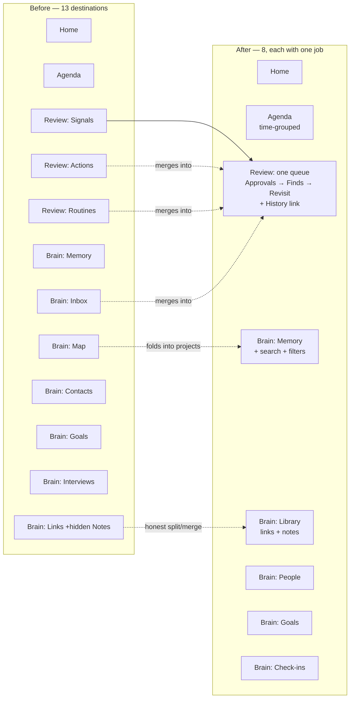

# Skippy UI/UX Improvement Plan

*Based on the 12 screenshots in `docs/ui-audit/` (Sep 2026) plus the app code. Written
in plain language. Wireframes for the proposed designs sit beside this file
(`01-home.svg`, `02-agenda.svg`, `03-review.svg`, `06-brain.svg`).*

> **Owner decision (Sep 4):** Review loses its Signals / Actions / Routines tabs and
> becomes **one page, one queue**. Tab-to-tab navigation didn't help. The per-type
> card designs below all still apply — they just stack on a single page now
> (`03-review.svg` shows the unified page; it replaced the three per-tab wireframes).

---

## The short version

The app's bones are good: dark theme, consistent page headers, a clear three-hub idea
(Agenda / Review / Brain). But it was built piece-by-piece, and it shows in four ways:

1. **The machinery leaks through.** Raw JSON on Action cards, "confidence 50%",
   "rubric decision", "bounded map", "recall cadence unset" — the app talks like its
   own database instead of like Skippy.
2. **Lists are made of edit forms.** Signals and Goals show every item as a full
   editable form, all the time. Sixteen signals = sixteen walls of input fields.
   Reviewing should feel like flipping through cards, not filling out paperwork.
3. **There are two inboxes.** Uncertain *things* go to Review → Signals; uncertain
   *memories* go to Brain → Inbox. Same job, two places to check.
4. **Everything is shown at once.** No grouping by time on the Agenda, no
   collapsed/expanded states, duplicate items rendered twice, empty sections that
   still take up space.

The fix is not a rebuild. It's one reorganization (merge the inboxes), one new
pattern (compact card → expand for detail), and a pass of plain-language and
consistency cleanup.

---

## What's already working — keep it

- **The three-hub mental model** (Agenda = my plate, Review = my decisions, Brain =
  Skippy's knowledge). It matches how the system actually works. Don't blow it up.
- **Big friendly page headlines** ("One place to decide.", "Everything Skippy
  knows."). They give each hub a personality. Keep them.
- **Home as a daily launchpad** — Now, Quick capture, Agenda preview, review counts.
  Right idea, right order. It needs polish, not rethinking.
- **Dark theme and general card language.** Consistent enough to build on.

---

## Cross-cutting fixes (apply everywhere)

### 1. Plain language pass

| Today the app says | It should say |
|---|---|
| "Need a rubric decision." | "16 finds waiting for a yes or no" |
| "External effects awaiting approval." | "4 things Skippy wants to do — approve?" |
| `{"calendarId":"primary","eventId":...}` (raw JSON) | "Tue Oct 27 · All day · Jury duty" |
| "task signal, confidence 50%" | "Might be a task — Skippy wasn't sure" |
| "READ-ONLY ROUTINE PASS · recall cadence unset" | "Skippy looked for things worth revisiting" |
| "No linked accepted tasks in this bounded map." | "No tasks connected here yet." |

### 2. The card pattern: compact first, detail on demand

Every list item (signal, action, memory, goal, link) gets the same two states:

- **Compact row**: icon · title · one-line context · 1–2 chips · primary actions
- **Expanded / detail**: everything else (description, source, editing, history)

Nothing renders as an always-open form. Nothing shows raw internals in compact state.

### 3. One queue, period

Review becomes a **single page with a single list** — no Signals/Actions/Routines
tabs. Everything that needs a decision, in one scroll, with filter chips instead of
tabs:

```
All · 12        Approvals · 2        Finds · 7        Revisit · 3
```

- **Ordering, not tabs, carries the priority**: approvals (real-world side effects)
  pinned first, then finds (new knowledge awaiting yes/no), then revisit suggestions
  at the bottom. High stakes on top, housekeeping at the end of the scroll.
- Each card keeps its type-specific look (approval cards are big with
  Approve/Reject, finds are compact Accept/Edit…/Dismiss rows, revisit cards are
  Keep/Revise/Retire) — the chip and the buttons tell you what kind of decision it
  is, so mixing them in one list stays legible.
- Brain → Inbox merges in here too: a candidate memory is just one more find. Brain
  becomes purely "what Skippy knows," Review purely "what needs deciding."
- The nav badge becomes one number — the whole queue — and "Review zero" means an
  actually empty page, not three tabs to verify.
- Settled approvals move to a **History** link (quiet, top-right), not the queue.

### 4. Consistent status chips

One palette, used identically everywhere:
- 🔵 Blue = informational type (Event, Task, Memory, Link)
- 🟠 Orange = needs attention (Overdue, Waiting, Unsorted)
- 🟢 Green = done/approved/accepted
- 🔴 Red = rejected/failed
- Grey = neutral metadata (dates, categories)

Today "Recurring" is orange (why is a normal state alarming?), "saved" is green-on-link
rows but "accepted" elsewhere, and Finance/Personal categories look identical to type
chips. Pick lanes and stay in them.

### 5. Label the left nav

The icon-only rail has two brain icons (app logo + Brain hub) and no labels. Add text
labels (or at minimum tooltips + distinct active states), and show the review count as
a badge on the Review icon so "something needs me" is visible from any page.

### 6. Never render duplicates or empty shells

- The same Norwalk event appears twice on Home and twice on the Agenda. If two items
  share time + similar title, collapse to one row with a "2 copies — fix?" affordance.
- Routines shows "Stale assumptions — 0" and "Open questions — 0" as full sections.
  Hide empty sections; show one quiet line: "Nothing else to revisit."

---

## Page-by-page

### Home (`home.jpg`)

**What's wrong today**
- The empty state renders as a fake to-do: headline "Nothing new needs focus right
  now." then the *same sentence again* as a dismissible item with a Task chip and ✓/✗
  buttons. Empty states should be calm, not interactive.
- "Remember / Hold" toggle on Quick capture — meaning unclear (it's "process this vs.
  just store it," but nothing says so).
- Agenda preview shows the duplicate event twice.
- Review summary uses jargon (see language table above).

**Proposed** (see `01-home.svg`)
- **Now** card: when something needs focus, show it big with one-tap actions; when
  nothing does, a single calm line ("All clear — nothing needs you right now ✨") and
  *no* buttons.
- Quick capture: keep, relabel toggle to **"Act on it / Just save it"** with a helper
  line under the box.
- Agenda preview: grouped by day, deduped, max ~5 rows, "Open Agenda →" link.
- **Needs your review**: one card, plain-language rows with count badges ("2 things
  Skippy wants to do — approve?", "7 finds waiting for a yes or no"), each
  deep-linking into the unified Review queue with the matching filter pre-selected.

### Agenda (`Agenda.jpg`)

**What's wrong today**
- 53 items in one flat, undifferentiated scroll. No date group headers (the Home
  *preview* has them — the full page doesn't!).
- Category chips (Errand/Finance/Personal/Social/Unsorted/Work) exist but the list
  under "All" gives no visual grouping, so Finance bills, birthdays, and flights
  interleave randomly.
- Chip soup per row: type + category + date, all styled alike; "Recurring" screams
  orange; overdue item styled almost like everything else.
- Mystery icon buttons on the right edge (bell, pause) with no labels.

**Proposed** (see `02-agenda.svg`)
- **Group by time**: `Overdue` (pinned, red accent) → `Today` → `Tomorrow` → `This
  week` → `Later`. Within groups, sort by time.
- Row anatomy: type icon (📅 event / ☐ task / 🔁 recurring) · title · time/place line ·
  *one* category chip. Overdue gets the only loud treatment on the page.
- Keep the filter chips, add counts (`Finance 12`), and make **Unsorted** a visible
  badge on the page header when > 0 — it's a to-do ("sort me"), not just a filter.
- Row actions appear on hover/tap with labels ("Snooze", "Pause routine").

### Review — one page (`Review signals.jpg`, `Review Actions.jpg`, `Review Routines.jpg`)

The three subsections below were originally written as three tabs; per the owner
decision they are now **sections of a single queue**, in this order:

1. **Approvals** (was Actions) — pinned to the top; highest stakes
2. **Finds** (was Signals, plus Brain Inbox) — the bulk of the queue
3. **Revisit** (was Routines) — bottom of the scroll; suggestions only

Filter chips (`All · Approvals · Finds · Revisit`) replace the tabs. Empty sections
disappear entirely rather than rendering headers. The card designs, buttons, and
copy proposed below are unchanged — only the container changed.

#### Finds (was Signals)

**What's wrong today**
- Every signal is a full, always-open edit form — 9 fields each, 16 of them stacked.
  Triage (a seconds-per-item activity) is visually identical to data entry
  (a minutes-per-item activity).
- The same Marco Polo signal appears twice, as two full forms.
- Five icon-only buttons (✓ ⏱ ⤨ 🔗 ✗) carry all the meaning, unlabeled.
- "task signal, confidence 50%" leaks internals.

**Proposed** (see `03-review.svg`, Finds section)
- **Compact triage cards**: icon · proposed title · one-line why ("From a Marco Polo
  email, Aug 30") · type chip ("Task?") · three labeled buttons: **Accept** ·
  **Edit…** · **Dismiss**.
- **Edit…** expands the card into the current form (all those fields have a purpose —
  they're just not for *triage*).
- Filter row: `All · Tasks · Notes · Memories · Contacts · Links` — this is where the
  Brain Inbox merges in.
- Near-duplicate candidates auto-group into one card: "2 similar finds" with a single
  Accept/Dismiss.
- Optional keyboard flow (→ accept, ← dismiss, ↓ next) turns 16 items into a
  90-second sweep.

#### Approvals (was Actions)

**What's wrong today**
- Card bodies are **raw JSON dumps**. The single highest-stakes surface in the app —
  "may Skippy touch your real calendar?" — is the least readable page in it.
- Completed and rejected history is mixed into the same list as pending approvals; the
  badge says 4 but the list shows many settled items.
- The conflict warning (`reviewWarning`) — the safety feature we just built — has no
  visible home on the card.

**Proposed** (see `03-review.svg`, Approvals section)
- **Render actions as event cards**: title · 📅 day/date/time · 📍 location · the
  description as readable text · which agent proposed it and from what source.
- **Conflict warnings front and center**: an orange banner on the card — "⚠️ You
  already have 'Jury duty' that day" — because that's exactly the information the
  approve/reject decision needs.
- Big labeled buttons: **Approve** (primary) · **Reject**. Approving shows "→ on your
  calendar in ~2 seconds" feedback.
- **Only pending approvals live in the queue.** Settled items (approved / rejected /
  executed) move behind the quiet **History** link — a queue is not a log.

#### Revisit (was Routines)

**What's wrong today**
- Naming collision: this section is *recall suggestions* (stale assumptions, open
  questions, decisions to revisit) — but "Routines" reads as recurring chores, which
  actually live on the Agenda as "Recurring." Two different concepts, one word.
- Two empty sections ("0") rendered at full height above the one section with content.
- Header jargon: "READ-ONLY ROUTINE PASS … recall cadence unset."

**Proposed** (see `03-review.svg`, Revisit section)
- **Rename to "Revisit."** Plain meaning: "things worth a second look." It sits at
  the bottom of the unified queue — suggestions only, never above real work.
- Hide empty sections entirely. Lead with what exists ("3 decisions worth revisiting"),
  each as a compact card: decision title · when it was made · why it resurfaced ·
  **Keep** · **Revise** · **Retire** buttons.
- Header becomes: "Skippy re-checks old assumptions, open questions, and past
  decisions. Suggestions only — nothing changes without you."

### Brain overall (`Brain *.jpg`)

**What's wrong today**
- **Seven tabs** for what is really four kinds of content: knowledge (Memory), saved
  stuff (Links *and* the Notes column hiding inside the Links tab), people
  (Contacts), and aims (Goals) — plus a tool (Interviews) and a browser (Map).
- **Inbox** duplicates Review (fix #3 above moves it out).
- **Links tab secretly contains Notes** as a second column. The nav says Links; the
  user listed Notes as its own area. Make it honest.
- **Contacts layout breaks** on long bios — Matt Blanchard's card renders one word
  per line down the whole page; Jeff's own profile is a wall of text in the list view.
- **Goals are always-open edit forms** (same disease as Signals).
- **Memory** cards show full text + confidence + kind + source chips all at once; no
  filter by kind (memory / decision / principle), search only exists over on Map.
- **Map** isn't a map — it's a per-project context browser (useful!) with a graph's
  name.

**Proposed** (see `06-brain.svg`)
- **Five tabs, honestly named:**
  `Memory · Library · People · Goals · Check-ins`
  - **Memory** — gains the search bar (moved from Map) + kind filter chips
    (`All · Facts · Decisions · Principles`). Cards compact: title · kind chip ·
    date; text expands on tap. Confidence % moves into the expanded view.
  - **Library** — the honest merge of Links + Notes, with type filter
    (`All · Links · Notes`). Auto-group the 10+ near-identical "YouTube Short" rows
    into one collapsed cluster.
  - **People** — Contacts, with fixed card anatomy: name · relationship · one-line
    summary, **clamped to 2 lines**, full bio in a detail panel. Companies as a
    filter or section, not a competing column.
  - **Goals** — read-view cards (title · status dot · progress/description line),
    edit on tap. "Add a goal" collapses to a button.
  - **Check-ins** — Interviews, renamed to what they are. Active ones float to top
    with a "Continue (1 of 4)" button.
  - **Map** — fold into project pages ("Context" section per project) or keep as a
    power-user view behind a "Connections" link on Memory. Either way it stops
    occupying a top-level tab it can't fill.

---

## The reorganization at a glance



---

## Suggested rollout order

**Phase 1 — Language & cosmetics (no data model changes, quick wins)**
1. Plain-language pass on all headers, empty states, and the Home review card
2. Render approval cards as readable event cards instead of JSON (+ conflict banner)
3. Hide empty sections in Revisit; rename Routines → Revisit
4. Chip color system + nav labels/badge

**Phase 2 — The card pattern**
5. Signals → compact triage cards with expand-to-edit
6. Goals → read cards with tap-to-edit
7. Contacts → clamped cards + detail panel
8. Agenda → time-grouped sections + overdue pinning

**Phase 3 — Reorganization (small data/plumbing changes)**
9. Collapse Review's three tabs into the one queue (Approvals pinned → Finds →
   Revisit; filter chips; History link) and merge Brain Inbox into Finds
10. Merge Links + Notes into Library
11. Move search + kind filters onto Memory; fold Map into project context
12. Duplicate-collapsing on Agenda/Home rows

Each phase ships independently and nothing in Phase 1–2 blocks on Phase 3 decisions.

---

## Wireframes

| Page | File |
|---|---|
| Home | `01-home.svg` |
| Agenda | `02-agenda.svg` |
| Review — one queue (Approvals → Finds → Revisit) | `03-review.svg` |
| Brain | `06-brain.svg` |

These are structural wireframes, not visual design — they show layout, hierarchy, and
copy tone. The existing dark theme and typography carry over as-is.
