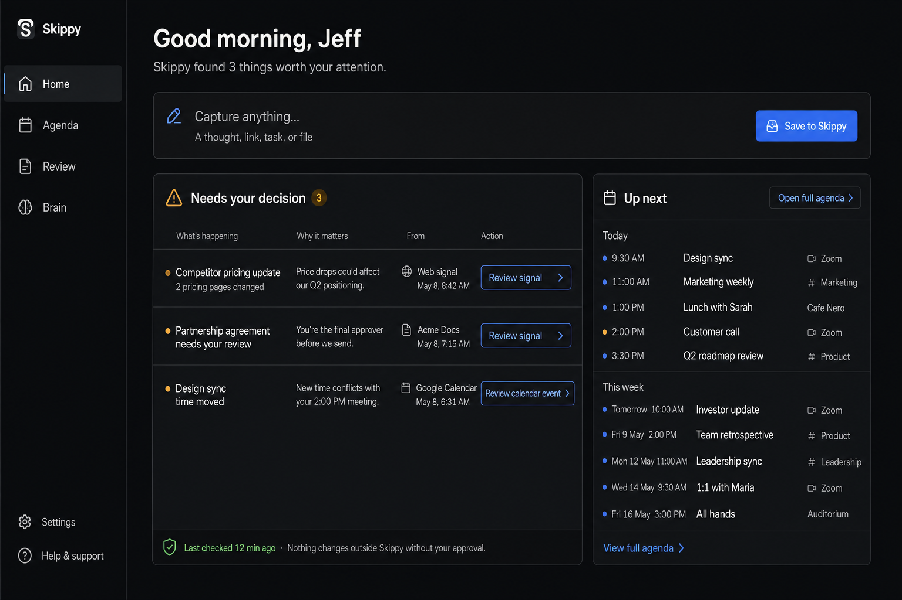
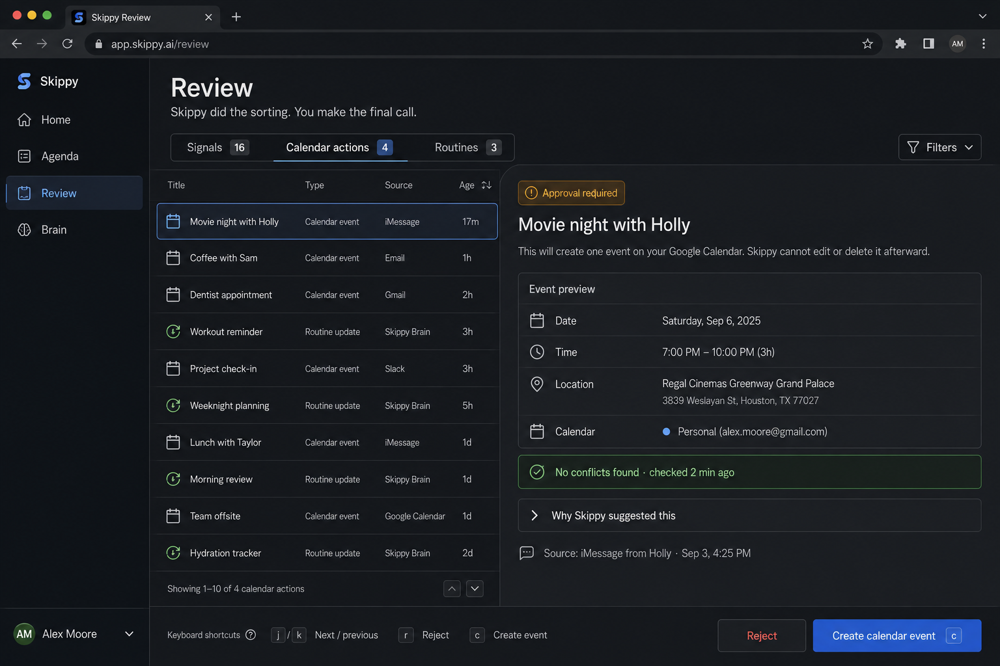
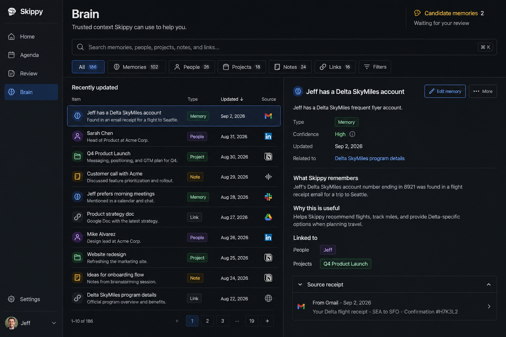

# Skippy Webapp UX/UI Redesign

Design audit and concept direction based on the supplied product-flow document and screenshots. This is a design proposal only; it does not prescribe implementation details or change application code.

## Executive summary

Skippy's underlying product model is strong: it watches incoming information, makes safe classifications, and asks the user to decide only when confidence or external consequences require it. The current interface obscures that model. It often presents storage structures, long records, and editing controls before it explains what happened, why it matters, or what the user should do.

The redesign should organize the experience around four user questions:

1. **Home — What needs my attention now?**
2. **Agenda — What is happening and what do I need to do?**
3. **Review — What decision is Skippy asking me to make?**
4. **Brain — What does Skippy know, and why does it know it?**

The primary design move is to replace the repeated wall of large cards with a consistent **compact row → selected detail → explicit action** pattern. Summaries remain scannable; detail and editing appear only on demand.

## Concept images

### 1. Home: attention and orientation

Home becomes a concise briefing. It says how many things need attention, presents a universal capture control, exposes a short decision queue, and previews what is coming next. The line “Nothing changes outside Skippy without your approval” makes the product's safety contract visible at the moment it matters.

### 2. Review: a real decision desk

Review uses a master–detail layout. The queue stays compact on the left; the selected item's consequence, structured preview, conflict status, rationale, provenance, and explicit decision buttons appear on the right. Raw payloads are removed from the default view.

### 3. Brain: a searchable knowledge browser

Brain becomes one searchable workspace for memories, people, projects, notes, and links. Dense rows support scanning; a persistent detail pane explains what Skippy remembers, why it is useful, how objects connect, and where the information came from.

These images are directional mockups. Their sample content is illustrative; the product's real labels and data should drive final content design.

## What is not working today

### The interface starts with the system instead of the user's task

Headlines such as “Everything Skippy knows” and “One place to decide” establish personality, but repeating oversized page introductions consumes valuable space without helping the next decision. On most return visits, the useful question is not where the user is; it is what changed and what they should do.

**Recommendation:** keep page identity compact and add a one-sentence task promise. Put counts, freshness, and the next meaningful action near the top.

### The same visual container is used for everything

Cards currently represent forms, empty states, list rows, records, summaries, actions, and groups. This flattens hierarchy and creates excessive vertical scrolling. A bordered rectangle no longer signals anything meaningful.

**Recommendation:** reserve cards for self-contained summaries or high-emphasis states. Use table-like rows for collections, sections for groups, and a detail pane or drawer for full records.

### Internal data leaks into the user experience

Review Actions shows serialized calendar JSON, while several Brain views expose long machine-like text and metadata. This asks the user to parse implementation data before making a decision.

**Recommendation:** translate every object into a semantic presentation. A calendar action should show Date, Time, Location, Calendar, Guests, conflicts, and source. Raw data can live behind a “View technical details” disclosure for debugging.

### Actions are ambiguous

Icon-only controls, generic labels such as “Open,” “Start,” “Capture,” and “Approve,” and unexplained status controls make it difficult to predict an outcome. In Review, that uncertainty is especially damaging because actions may touch an external system.

**Recommendation:** label actions with the object and consequence: “Create calendar event,” “Save memory,” “Dismiss signal,” “Open link,” “Start weekly review,” “Mark goal paused.” Pair destructive or external actions with a short consequence statement.

### Editing is shown before it is needed

Goals and Signals open as large editable forms. Most list visits are for scanning, choosing, or reviewing—not editing every field.

**Recommendation:** default to a readable summary. Open one selected record in a detail pane, and reveal editing through a clear “Edit” action. Use autosave or explicit “Save changes” consistently, not a mixture.

### Empty states occupy space but do not teach the system

“Inbox clear” is positive, but the large empty container leaves the user without context about what belongs there or where to go next.

**Recommendation:** make empty states compact and informative: “No candidate memories are waiting. Clear memories are saved automatically; uncertain ones appear here.” Offer one relevant next link, such as “Browse saved memories.”

### Layout behavior is fragile

The Contacts view demonstrates columns collapsing into unusably narrow text. Map and Links create long, uneven columns that make comparison and scanning difficult.

**Recommendation:** set resilient minimum widths, switch to a single-column list before columns become narrow, truncate previews at two lines, and move full content into a selected detail pane.

## Proposed information architecture

### Primary navigation

Use four labeled destinations at desktop widths:

- **Home** — status, capture, attention, and near-term agenda
- **Agenda** — tasks, events, routines, and time
- **Review** — all pending human decisions
- **Brain** — trusted long-term context and relationships

Settings and Help remain utilities. Chat can remain a persistent global action, but it should not obscure content.

The current icon-only sidebar saves little meaningful space and requires memorization. At typical desktop widths, visible labels are worth the additional 120–150 pixels. A compact icon-only mode can remain available when the viewport is constrained.

### Consolidate pending decisions

The separate Brain Inbox is conceptually another review queue. Surface candidate memories in **Review → Signals** with a Memory type, while preserving a “Candidate memories” shortcut in Brain. This gives the user one decision desk without erasing the distinction between trusted memories and candidates.

### Simplify Brain navigation

Treat Memory, People, Projects, Notes, and Links as object filters within one search workspace. Goals can either be a first-class Brain object type or a focused saved view. Interviews are an activity, not stored knowledge; make them accessible from an “Interview Skippy” action or a dedicated saved view rather than placing them beside object types. “Map” should be an alternate visualization of current search/filter results, not a separate silo.

## The reusable interaction model

### Collection view

Every collection should use the same anatomy:

- Optional group heading
- 44–64 px compact row
- Type/status icon
- Clear title
- One-line secondary summary
- At most two essential metadata values
- Visible selection state
- Detail on click, Enter, or keyboard navigation

Rows should not contain a cluster of unlabeled actions. Put the primary row action in the detail view and expose exceptional quick actions only when their meaning is unmistakable.

### Detail view

Every selected object should use this reading order:

1. **What is it?** Title and type
2. **Why am I seeing it?** Plain-language reason or status
3. **What will happen?** Consequence, especially for external actions
4. **What are the important facts?** Structured semantic fields
5. **Where did it come from?** Source receipt and timestamp
6. **What can I do?** Explicit verb-based controls

Editing is a mode within the detail view, not the default representation of the object.

### Progressive disclosure

Long descriptions, source excerpts, AI rationale, and technical payloads should be collapsed initially. Recommended disclosures:

- “Why Skippy suggested this”
- “Source receipt”
- “Related items”
- “View full description”
- “View technical details”

## Screen-by-screen recommendations

### Home

- Replace the large “Nothing new needs focus” hero with a compact greeting and attention summary.
- Combine Remember/Hold into one capture model with an optional destination chooser shown after content is entered. If the distinction matters, explain it in plain language.
- Change “Capture” to “Save to Skippy” or a destination-specific label.
- Show only the next 3–5 agenda items and link to the full Agenda.
- Merge “unclear signals” and “pending actions” into one compact “Needs your decision” queue while retaining meaningful type labels.
- Keep “actions taken” as a collapsible activity receipt, not a large permanent section.
- Show freshness and safety state: last successful check, disconnected sources, and whether anything is waiting for approval.

### Agenda

- Group by **Overdue**, **Today**, **Tomorrow**, and then date; do not present one undifferentiated list.
- Use lanes as filters, not repeated chips on every item when a single lane is active.
- Distinguish events, tasks, and routines through icon, row anatomy, and verbs—not color alone.
- Replace the ambiguous circular pause control with a labeled menu action such as “Skip this occurrence” or “Pause routine,” depending on the actual behavior.
- Remove duplicate events visually and communicate merging when Skippy detects duplicates.
- Offer a compact/comfortable density preference if needed, with compact as the default for desktop.
- Make completion reversible with a brief undo toast.

### Review: Signals

- Show a compact queue, not a full editable form for every signal.
- Summarize each signal as “Skippy found X because Y.”
- Display confidence as supporting context, not the decision itself. Prefer “Low / Medium / High” with an explanation over unexplained percentages.
- Present destination before acceptance: “Save as Task in Finance” or “Save as Memory.”
- Use explicit actions: “Save as task,” “Save as note,” “Dismiss.”
- Put merge and type-change actions in an overflow or edit flow with labels.

### Review: Actions

- Replace JSON with an object-specific preview.
- State the external consequence immediately above the controls.
- Show conflict and duplicate checks as a freshness-stamped safety panel.
- Use specific controls: “Create calendar event” and “Reject,” not generic approve/reject icons.
- Separate pending actions from action history. Completed/rejected records belong in a filterable History view and should not dominate the active queue.
- After execution, show a receipt: what was created, where, when, and a link to open it in the external system.

### Review: Routines

- Hide routine groups with zero suggestions by default, or collapse them into one quiet status summary.
- Make each suggestion a concise decision row with reason, age, and recommended next step.
- Explain what “revisit” means and what each outcome does: “Keep decision,” “Revise decision,” “Mark superseded,” or “Record outcome.”
- Keep source memory and transcript excerpts collapsed unless requested.
- Give routine cadence a human-readable value and a clear configuration link; never surface “unset” without a next action.

### Brain: Memory and Inbox

- Combine accepted objects into the searchable Brain browser.
- Clearly label trusted status without repeating an “accepted” badge on every row when the whole view is trusted.
- Truncate body previews and show the full memory in detail.
- Make the source receipt a standard object component.
- Route candidate memories into the unified Review queue; keep a shortcut and count in Brain.

### Brain: Links and Notes

- Avoid two independently scrolling masonry-style columns.
- Use one mixed result list with type filters, or a stable split view where the left side is results and the right side is selected detail.
- For links, show title, domain, saved date, read state, and optional summary. Move “Open,” “Archive,” and “Delete” into predictable positions.
- Rename “Discard” based on reality: “Remove from Brain” if it deletes, or “Archive” if recoverable.
- Make read/unread behavior explicit and avoid a permanent “saved” badge when every result in the view is saved.

### Brain: Contacts

- Use one searchable list with People/Companies filters rather than two uneven columns.
- Keep each row to name, relationship/role, organization, and last meaningful context.
- Move biographies and full relationship context into detail.
- Represent company/person relationships with linked chips or a Related section.
- Enforce minimum column widths and responsive collapse to prevent one-word-per-line text.

### Brain: Goals

- Show goal rows with title, status, progress signal, and next review date.
- Keep description and editing in detail.
- Replace the always-open creation form with a primary “New goal” action and focused modal/drawer.
- Explain status transitions. For example, “Pause goal” is clearer than selecting “paused” from a generic status menu.
- Add a “Why this matters” field and linked projects/actions so goals visibly feed Skippy's importance model.

### Brain: Interviews

- Lead with active interviews and a clear “Continue” action.
- Turn templates into compact selectable rows; show template purpose and expected time, not only question count.
- Replace “Start” with “Start weekly review” or the selected template name.
- Explain the result before starting: what Skippy will save and whether the user reviews it first.

### Brain: Map

- Treat Map as a visualization, not a collection of oversized nested cards.
- Start with a selected project/person/goal and show immediate relationships.
- Provide a list alternative for accessibility and dense browsing.
- Use filters for relationship type and time, and a detail pane for selected nodes.
- Avoid rendering full memory bodies inside the map; nodes need title, type, and one-line context.

## Content design system

### Button rules

Use **verb + object** whenever the result changes state:

| Avoid | Prefer |
|---|---|
| Approve | Create calendar event |
| Accept | Save as memory |
| Capture | Save to Skippy |
| Start | Start weekly review |
| Open | Open link |
| Discard | Archive link / Remove link |
| ✓ / × | Mark complete / Dismiss |

Icon-only buttons should be limited to universally understood utilities such as close, search, or overflow—and still require accessible names and tooltips.

### Status language

Use three separate concepts consistently:

- **State:** active, paused, completed, archived
- **Trust:** candidate, trusted, rejected
- **Urgency:** overdue, due today, upcoming

Do not mix these into one badge vocabulary. Color reinforces meaning but never carries meaning alone.

### Explanatory copy pattern

For every review item, answer these in two short lines:

- **Why this matters:** “Holly proposed a specific date and time.”
- **What happens next:** “Creating this adds one event to your Personal calendar.”

This is more useful than exposing confidence and serialized source data without interpretation.

## Visual system direction

The existing aesthetic is worth keeping: dark neutral surfaces, warm white typography, restrained green, blue, and amber accents, and modest corner radii. The redesign should refine rather than rebrand it.

- Use one page background, one raised surface, and one selected/hover surface.
- Reduce border prominence; spacing and background shifts should carry most grouping.
- Use an 8 px spacing base with compact 12/16 px row padding.
- Target 44 px minimum interactive height while allowing visually dense rows.
- Use a restrained type scale: 32 px page title, 20–24 px section title, 16 px row title, 13–14 px metadata.
- Cap prose measure around 65–75 characters in detail views.
- Keep semantic accents stable: blue action/selection, mint trusted/safe, amber attention, red destructive/error.
- Avoid pills for ordinary metadata; reserve them for categorical status that benefits from quick comparison.

## Accessibility and resilience

- Meet WCAG 2.2 AA contrast for text, controls, borders, and focus indicators.
- Provide persistent keyboard focus, logical tab order, and shortcuts only as enhancements.
- Do not communicate status with color alone.
- Make every control's accessible name describe its outcome.
- Preserve zoom to 200% without horizontal page scrolling at standard desktop breakpoints.
- Collapse split panes into list → detail navigation on narrow screens.
- Keep destructive actions separated from primary actions and provide recovery where possible.
- Announce async outcomes and failures; pair toasts with durable activity receipts for external actions.

## Recommended design sequence

### Phase 1: clarify decisions

1. Replace raw Action JSON with semantic previews.
2. Rename ambiguous actions with verb + object labels.
3. Add consequence, rationale, provenance, and safety/freshness blocks.
4. Establish the shared row/detail pattern in Review.

### Phase 2: reduce density problems

1. Convert Agenda, Memory, Links, Contacts, and Goals to compact rows.
2. Move full text and editing into a detail pane or drawer.
3. Standardize empty, loading, error, and completed states.
4. Fix responsive minimum widths and truncation.

### Phase 3: simplify navigation

1. Move to labeled Home, Agenda, Review, and Brain destinations.
2. Consolidate candidate memory decisions into Review.
3. Reframe Brain tabs as object filters and Map as a view mode.
4. Turn Home into the system-wide orientation and attention layer.

## Success measures

Validate the redesign with task-based tests rather than aesthetic preference alone:

- A user can explain what will happen before approving an external action.
- A user can clear five review items without opening five separate pages.
- A user can find the source of a saved memory in under 15 seconds.
- A user can distinguish a trusted memory from a candidate without relying on color.
- A user can identify today's next commitment and overdue task in under 5 seconds.
- No default view exposes JSON or requires horizontal scanning of long prose.
- At 200% zoom, core tasks remain usable and action labels remain visible.

The guiding principle is simple: **Skippy should show the judgment it needs from the user, not the machinery it used to get there.**
